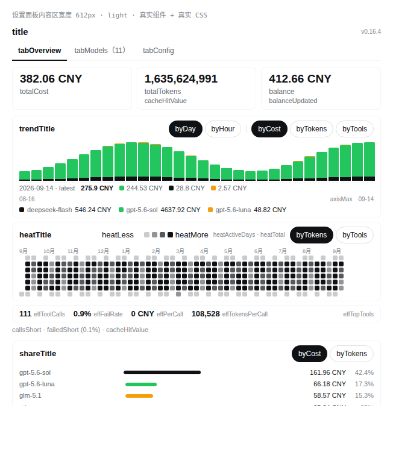
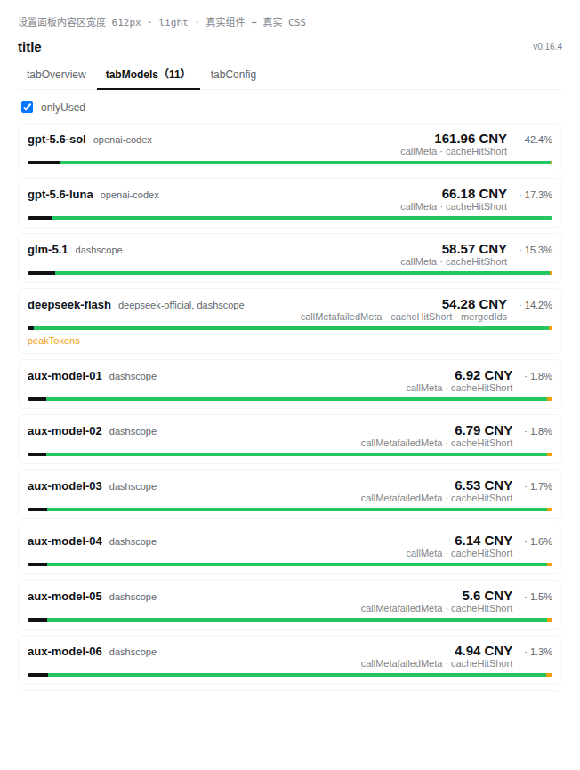
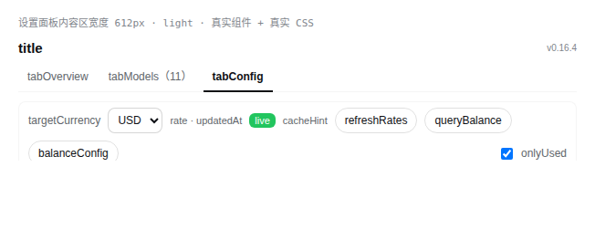
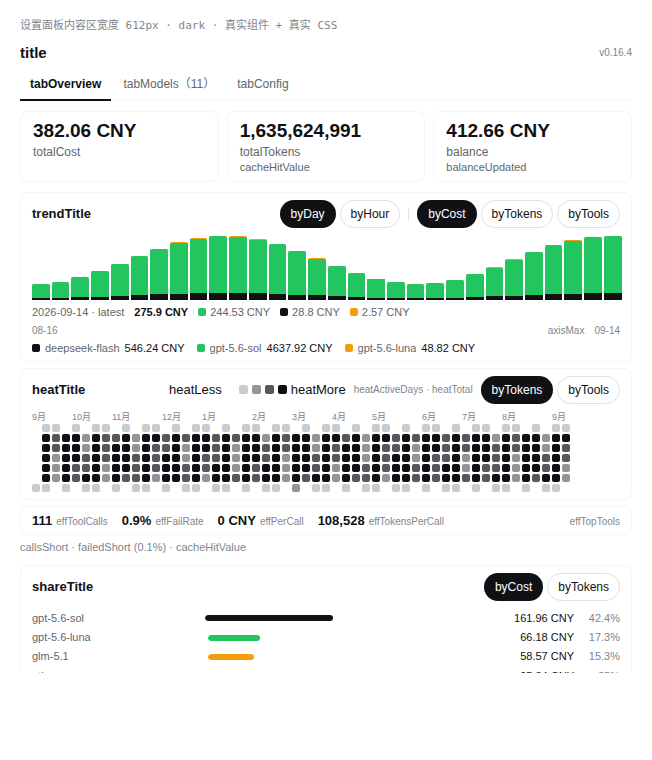

# 模型消耗统计（model-usage-plugin）

DeepSeek Harness（DSH）Web 设置面板插件：统计各模型的 token 消耗与估算费用，展示用量趋势、开发活跃度与 API 账户余额。

`npm` 安装 · MIT License · Node ^22.19 || >=24（与 DSH 一致）



## 它回答什么

- **花了多少钱** —— 按模型估算费用，并换算到你关心的货币
- **钱花在哪个模型上** —— 费用占比（不是 token 占比：调用少但单价高的模型才是优化点）
- **什么时候贵** —— 按天 / 按小时的堆叠柱，可在费用、Tokens、工具调用三种口径间切换
- **最近是不是一直在干活** —— GitHub 风格的一年活跃度热力图
- **花得值不值** —— 工具调用数、失败率、每调用均价、每调用 Token、高频工具
- **账户还剩多少** —— 直接查询 DeepSeek 账户余额

数据全部来自你自己的会话记录，不联网上报。

## 安装

需要 DSH 的 Web profile（`dsh web` 能正常启动）。

**npm（推荐）**

```bash
dsh plugin --profile web add model-usage-plugin
dsh web          # 重启使插件生效
```

`dsh plugin` 会把包装进 profile 并自动登记为 bundle 层；本包含 `dsh.bundle.patch` 声明，无需手改配置。

**从 GitHub**

```bash
dsh plugin --profile web add github:AKS1st/model-usage-plugin
dsh web
```

**从源码（本地开发）**

```bash
git clone https://github.com/AKS1st/model-usage-plugin.git
dsh plugin --profile web add /path/to/model-usage-plugin
dsh web
```

**卸载**

```bash
dsh plugin --profile web remove model-usage-plugin
dsh web
```

统计文件 `$DSH_HOME/musage-stats.json` 会保留，需要一并清理时手动删除即可。

## 使用

打开 **设置 → 模型消耗**，共三个页签：

| 页签 | 内容 |
| --- | --- |
| **总览** | 花费 / 总 Token / 账户余额 → 用量趋势 → 活跃度热力图 → 效率指标 → 花费去向 |
| **模型明细** | 全部模型（按费用降序），可展开查看 token 构成、修改单价、启用峰谷定价 |
| **配置** | 目标货币与汇率、余额查询、手动添加模型 |

装好后不需要任何配置：用量从插件运行起自动累积，**历史用量也会自动补齐**（插件的台账原先不存在的那部分，会从会话日志里回填，热力图卡上会显示"已回填 N 天历史"）。

<details>
<summary>另外两个页面的截图</summary>

模型明细（按"提供服务的模型"分组，同一模型的历史 id 合并成一张卡）：



配置页：



深色主题下同一套设计令牌，配色自动跟随：



</details>

## 费用怎么算

费用 = Σ(各类 token × 对应单价)，按你设置的目标货币与汇率换算。缓存命中、缓存未命中、
缓存写入、输出**分开计价**——它们的单价差一两个数量级，合在一起算会差出好几倍。

**这是估算，不是账单。** 它不含官方折扣、赠送额度、阶梯价与税费；请以官方账单为准。

### 内置默认价

首次使用自动套用，可在"模型明细"里逐个修改，或点"重置"回到内置默认。

| DeepSeek 模型 | 缓存命中 | 缓存未命中 | 输出 |
| --- | --- | --- | --- |
| `deepseek-flash`（V4.1-Flash）空闲 | ¥0.02 | ¥1 | ¥4 |
| `deepseek-flash`（V4.1-Flash）高峰 | ¥0.04 | ¥2 | ¥8 |
| `deepseek-v4-pro`（V4-Pro-0813）空闲 | ¥0.15 | ¥4.5 | ¥13.5 |
| `deepseek-v4-pro`（V4-Pro-0813）高峰 | ¥0.30 | ¥9.0 | ¥27.0 |

单位：人民币 / 百万 tokens。**高峰 = 空闲两倍**，窗口为 UTC 周一至周五
01:00–04:00 与 06:00–10:00，其余时间按空闲价。

已下线的 `deepseek-v4-flash`、`deepseek-v4-flash-0731`、`deepseek-v4-flash-vision-exp`
请求由 V4.1-Flash 提供服务并按 Flash 价计费，因此与 `deepseek-flash` 计为同一个模型
（明细页会在卡片上标注合并了哪些 id，展开可看各自分项）。按官方公告，
`deepseek-v4-pro` 在 2026-09-14 12:00（北京时间）之后同样改由 V4.1-Flash 服务并按 Flash 价计费，
插件内置了这条带生效时间的规则。

### 第三方模型

| 模型 | 单价（每百万 tokens） |
| --- | --- |
| `glm-5.1` | CNY 6 / 24 / 缓存 1.6（官方价，取 ≤32k 输入档） |
| `glm-5.3-flash`、`z-ai/glm-5.3-flash`、`stealth/ox-alpha` | USD 0.15 / 0.50 / 缓存 0.03 |
| `glm-5.2`、`glm-5.3` | USD 1.40 / 4.40（官方未公布，按上一代旗舰行情预置，**请自行核对**） |
| `gpt-6-astra` | USD 10 / 50 |

模型 id 会自动归一（provider 前缀、日期后缀、`:batch` 变体、DeepSeek 旧 id），因此
日常用的别名都能命中同一条价格。

### 峰谷定价

每个模型都能单独开启：最多两个高峰时段（`HH:MM`，支持跨零点），可指定时区与"仅周一至周五"，
高峰价留空则沿用正常价。默认已按 DeepSeek 官方窗口配好。

**不会出现"计价为 0"**：内置价目之外的模型会显示"未配置价格"而不是 ¥0（¥0 会被读成免费），
你可以手动补一条单价。

## 账户余额

在"配置"页填写 API Key 与余额接口 Base URL 后点"保存并查询"。API Key 留空则使用
`DEEPSEEK_API_KEY` 环境变量；**页面里填写的 Key 只保存在内存，不会写入磁盘**。

## 数据与隐私

- 统计、价格、汇率缓存与时间台账全部保存在 `$DSH_HOME/musage-stats.json`
- 统计接口只接受本机 loopback 同源请求；**不要把带本插件的 WebServer 暴露到公网**
- 只有两处联网：汇率换算（可缓存一周）与余额查询（只有你点击时才发起）
- 不上报任何用量数据，不抓取官方价格

## 常见问题

**装好了但设置里没有这个页签？**
插件必须**重启 dsh web** 才生效。面板标题旁会显示当前运行中的版本号（`vX.Y.Z`），
用它判断"跑的是不是新代码"：版本号变了才说明加载成功。

**费用和官方账单对不上？**
本插件是**估算**：只按 token 数与单价相乘，不含折扣、赠送额度、阶梯价、税费；汇率也是近似值。
它的用途是"看清钱花在哪、哪个模型值得优化"，不是替代账单。

**token 数怎么这么大？**
缓存命中读取也算 token——这正是官方计费的算法。Agent 每次请求都会携带完整上下文，
命中缓存的部分单价极低但数量很大，所以总 Token 常见以亿计，其中 95% 以上往往是缓存命中。

**历史用量看不到？**
插件的实时台账从安装时开始，历史部分由启动时自动回填（只补缺失的日子，不重复计数）。
热力图卡上会写明"已回填 N 天历史"；会话很多时需要几分钟，重启后稍等即可。

**首页只列了几个模型？**
总览只展示花费最高的几行，完整列表在"模型明细"页——这样首页高度不随模型数量增长。

**余额查询失败？**
检查 API Key 是否有效、Base URL 是否可达。填在页面里的 Key 重启后需要重新填写，
需要持久化请用 `DEEPSEEK_API_KEY` 环境变量。

## 开发

架构、设计约束、测试与验证流程见 [docs/DEVELOPMENT.md](https://github.com/AKS1st/model-usage-plugin/blob/main/docs/DEVELOPMENT.md)：

```bash
npm test             # 单元测试（jsdom / react 从 DSH 安装目录解析，本包无依赖）
npm run verify       # 上线前闸门：不启动、不重启 dsh web
```

## License

MIT
